# kdae-panel

[dae](https://github.com/daeuniverse/dae) 及其兼容分支的 Web 管理面板。

面板不引用 dae 的内部 Go 包，也不读取 eBPF Map，只通过公开命令、`.dae` 配置文件、systemd 和 journald 管理 dae。dae 内部重构通常不需要面板跟着改。

## 界面预览

<table>
  <tr>
    <td colspan="2" width="33%" align="center"><strong>运行概览</strong><br>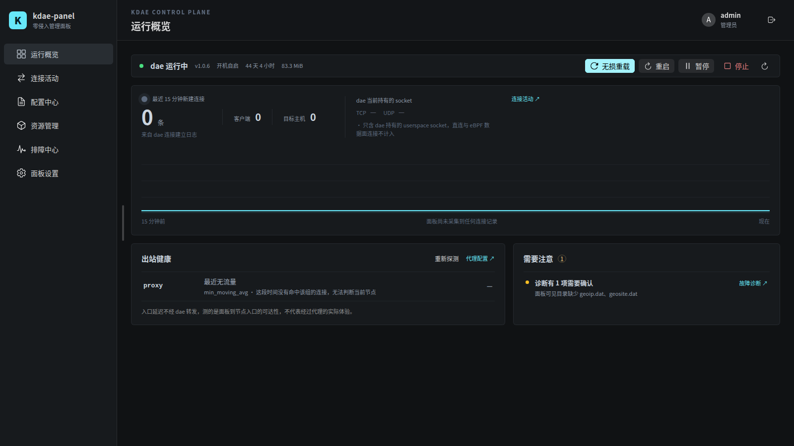</td>
    <td colspan="2" width="33%" align="center"><strong>连接活动</strong><br>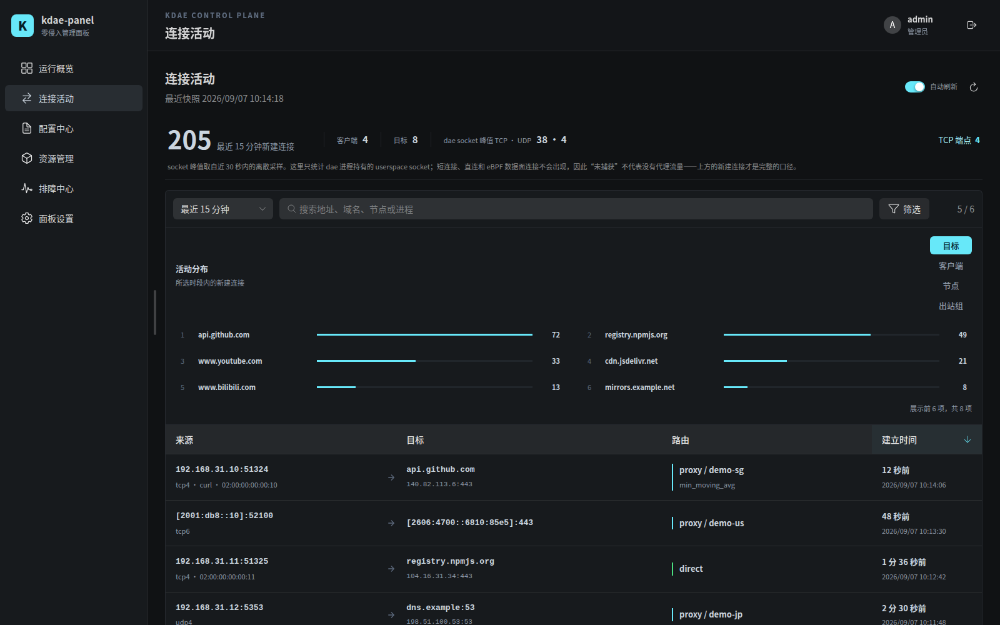</td>
    <td colspan="2" width="33%" align="center"><strong>代理配置</strong><br>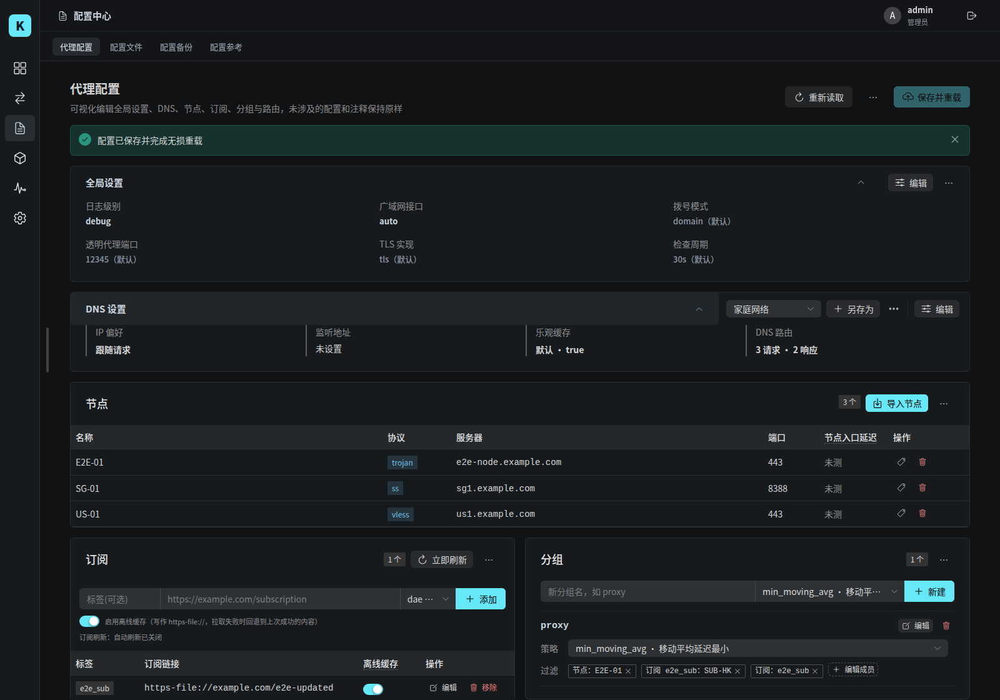</td>
  </tr>
  <tr>
    <td colspan="2" align="center"><strong>配置管理</strong><br>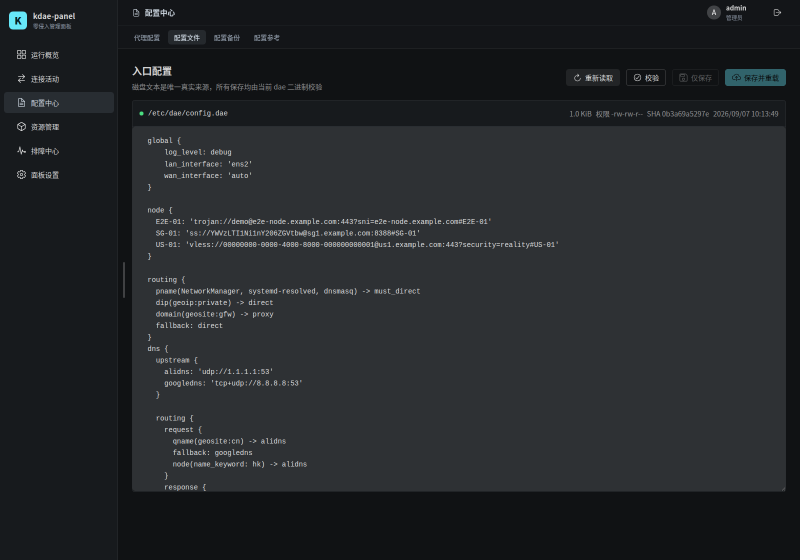</td>
    <td colspan="2" align="center"><strong>动态配置能力</strong><br>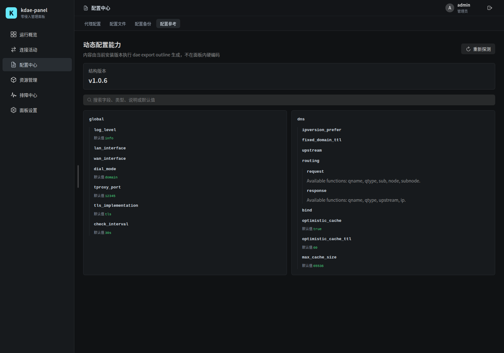</td>
    <td colspan="2" align="center"><strong>dae 版本管理</strong><br>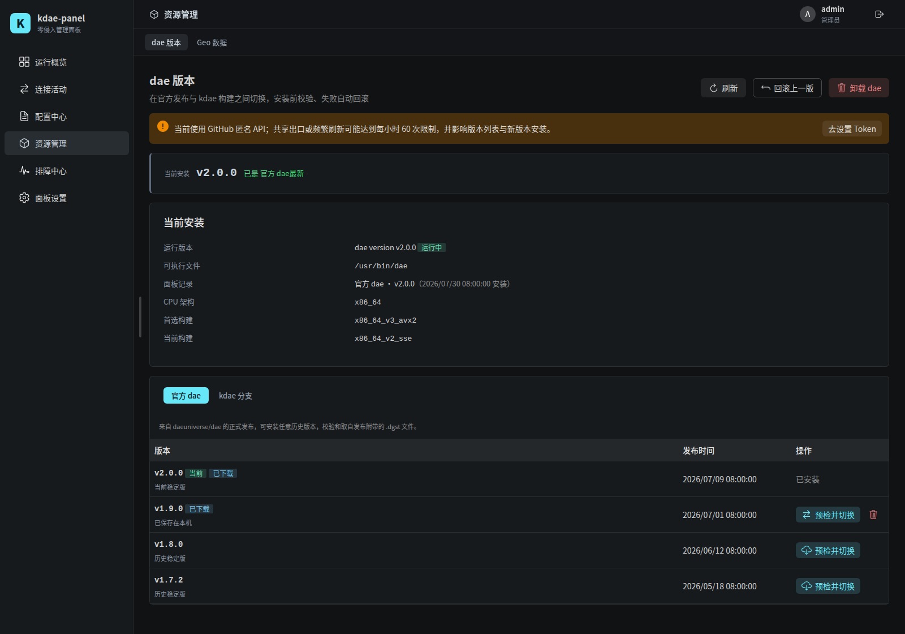</td>
  </tr>
  <tr>
    <td colspan="2" align="center"><strong>Geo 数据管理</strong><br>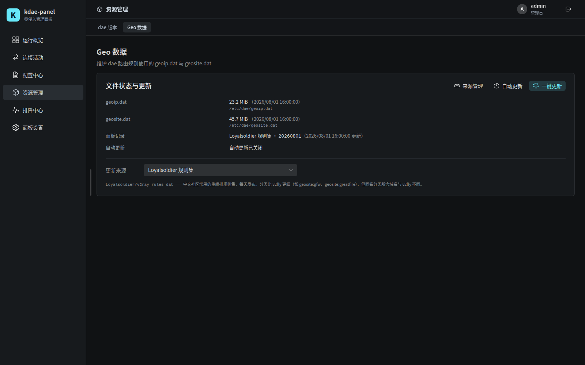</td>
    <td colspan="2" align="center"><strong>故障诊断</strong><br>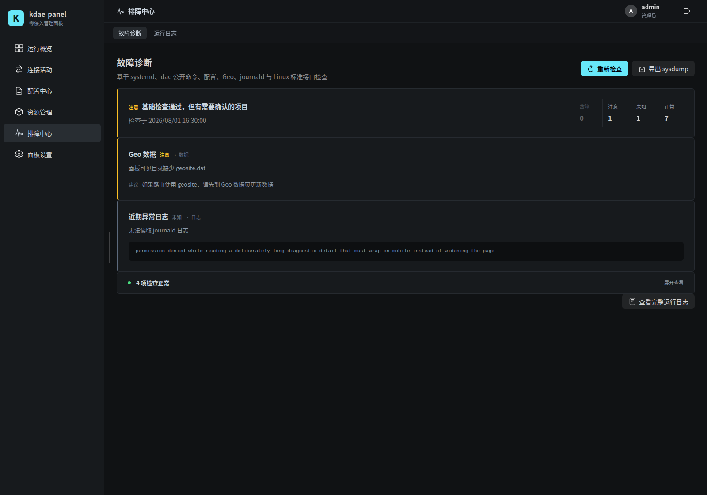</td>
    <td colspan="2" align="center"><strong>运行日志</strong><br>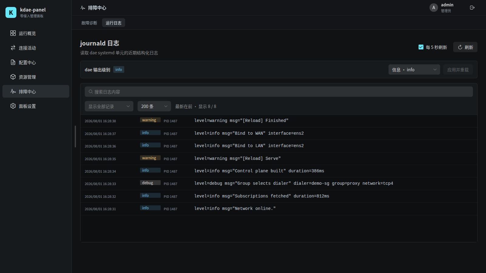</td>
  </tr>
  <tr>
    <td colspan="3" width="50%" align="center"><strong>配置备份</strong><br>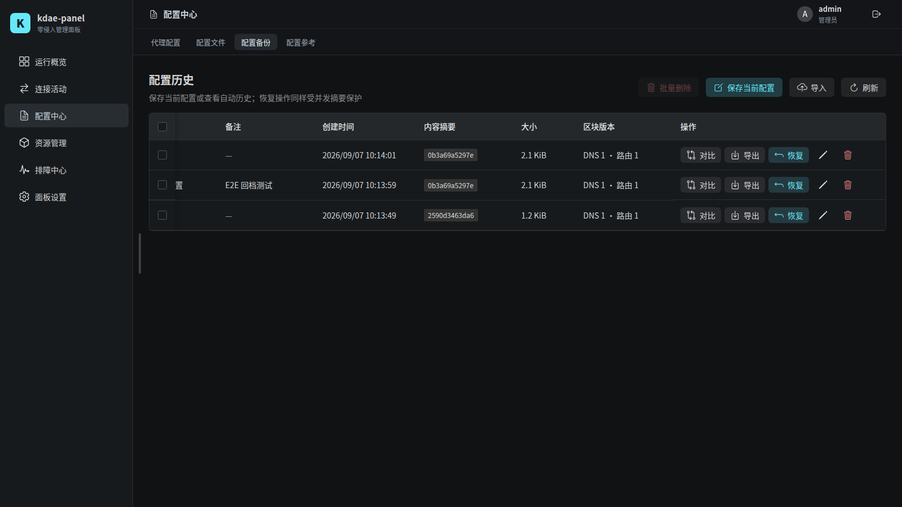</td>
    <td colspan="3" width="50%" align="center"><strong>面板设置</strong><br>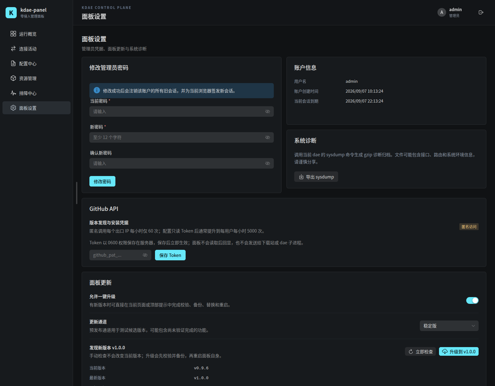</td>
  </tr>
</table>

*截图中的数据均为演示数据。*

## 功能

- **服务控制**：启动、停止、重启、无损重载、暂停；启停同步开机自启。
- **可视化配置**：全局设置、DNS、节点、订阅、分组与路由，未改动的配置和注释原样保留。
- **动态配置结构**：通过 `dae export outline` 读取当前版本支持的字段，不维护固定清单。
- **安全保存**：保存前 `dae validate`，自动备份、原子替换，重载失败自动回滚。
- **配置存档**：命名存档、差异预览、导入导出。
- **dae 版本管理**：在官方发布与 kdae CI 构建之间安装、切换、回滚、卸载，失败自动恢复。
- **Geo 数据**：一键或定时更新，内置 Loyalsoldier 与 v2fly，支持自定义来源。
- **订阅**：离线缓存、立即刷新、定时刷新，支持自定义 User-Agent。
- **连接活动**：连接建立流水、按目标/客户端/节点聚合，以及 dae 的 socket 采样。
- **节点延迟**：公网用 ICMP、内网用 TCP，结果不经过当前代理。
- **故障诊断**：汇总服务、配置、Geo、网络、内核与近期异常日志，可导出 sysdump。
- **面板自升级**：校验后替换自身并重启。
- 单个 Go 二进制，支持 Linux `amd64` / `arm64` / `riscv64`。

## 安装

在有 systemd 的 Linux 上以 root 执行：

```bash
bash -c "$(curl -fsSL https://raw.githubusercontent.com/tuoro/kdae-panel/main/scripts/get.sh)"
```

脚本会下载最新发布包，核对 `SHA256SUMS` 后安装并启动面板。重复执行即可升级。固定版本可在命令前加 `KDAE_PANEL_VERSION=vX.Y.Z`。无法直连 GitHub 时的手动安装方式见 [部署文档](docs/deployment.md#手动下载安装)。

机器上还没有 dae 时，装好面板后在「dae 版本管理」页完成首次安装。

从源码安装（需要 Go 1.26+、Node.js 22+）：

```bash
git clone https://github.com/tuoro/kdae-panel.git
cd kdae-panel
npm ci --prefix web
make build
sudo ./scripts/install.sh
```

## 首次访问

面板默认监听 `0.0.0.0:2023`。安装结束时终端会打印一次性初始化链接，在浏览器打开后设置管理员用户名和密码即可。

局域网直连是明文 HTTP，只适合可信内网。需要跨网络访问时，请使用 [HTTPS 反向代理](docs/deployment.md#https-反向代理) 或 SSH 隧道。

## 卸载

```bash
bash -c "$(curl -fsSL https://raw.githubusercontent.com/tuoro/kdae-panel/main/scripts/uninstall.sh)"
```

默认保留配置、账户和备份；在命令前加 `KDAE_PANEL_PURGE=true` 会一并清除。卸载不会影响 dae。

## 文档

- [部署、配置与升级](docs/deployment.md)
- [架构与兼容策略](docs/architecture.md)
- [HTTP API](docs/api.md)
- [开发与发布](docs/development.md)
- [安全策略](SECURITY.md)

## 许可证

GNU Affero General Public License v3.0，详见 [LICENSE](LICENSE)。
